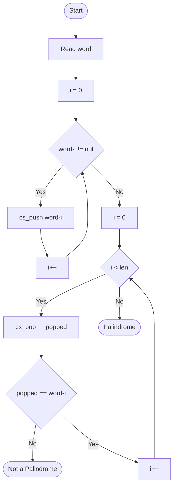

### Mini PBL The Palindrome Checker

1. The Scenario (5 minutes)
You have been hired to develop a search engine that identifies linguistic patterns.
One of the tasks is to create a function that checks if a word is a palindrome (read the same way backwards and forwards, like "RADAR", "ANA" or "OSSO").

The Challenge: Using Stack or Queue operations (or both), how can you check if the word is a palindrome?

Rules:
1. You cannot use ready-made string functions like strrev.
2. You must use data structure logic in the solution (operations).


#### Helpers 
```c
typedef struct Node {
  char letter;
    struct Node *next;
}
```

### Questions

1. What is the most suitable data structure? Why?

> R: The Stack. Its LIFO property naturally reverses the character sequence through push/pop alone — no auxiliary reversal function
needed. Pushing each character of the word and then popping them yields the word in reverse order. Comparing that reverse against
the original character by character is sufficient to determine if the word is a palindrome.

2. Develop the C implementation of the solution involving only the operations of the chosen data structure.

> R: See problems/palindrome.c. The core logic in isPalindrome uses only two stack operations — cs_push and cs_pop

